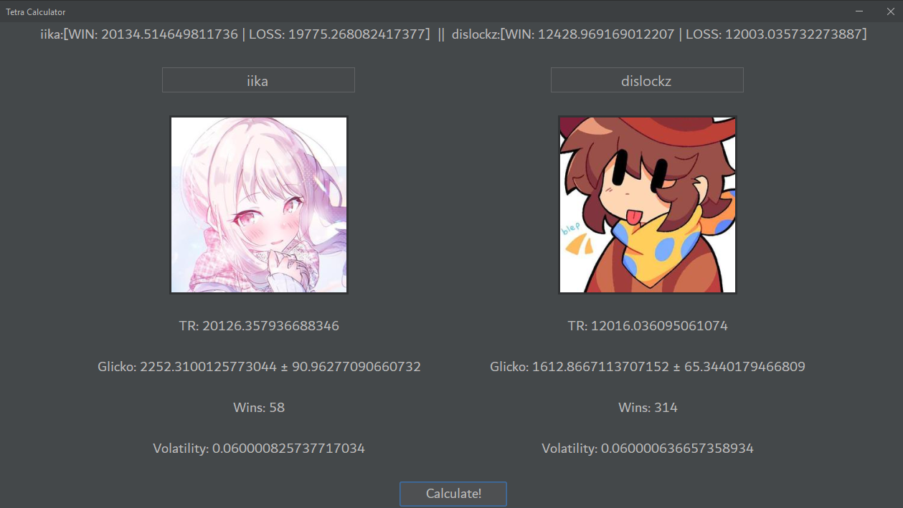

# Tetra Calculator
A hastily and badly coded calculator that predicts what TR players will end up at after a match in [TETR.IO](https://tetr.io) Tetra League.

## How to Use (Requires [Java](https://adoptium.net/temurin/releases/?os=any&arch=any&version=21))
1. Run the `.jar` file
2. Enter 2 names in the text boxes on top
3. Press "Calculate!"
4. Results will appear at the top in the form `PLAYER1:[TR IF WIN | TR IF LOSS] || PLAYER2[TR IF WIN || TR IF LOSS]

---

