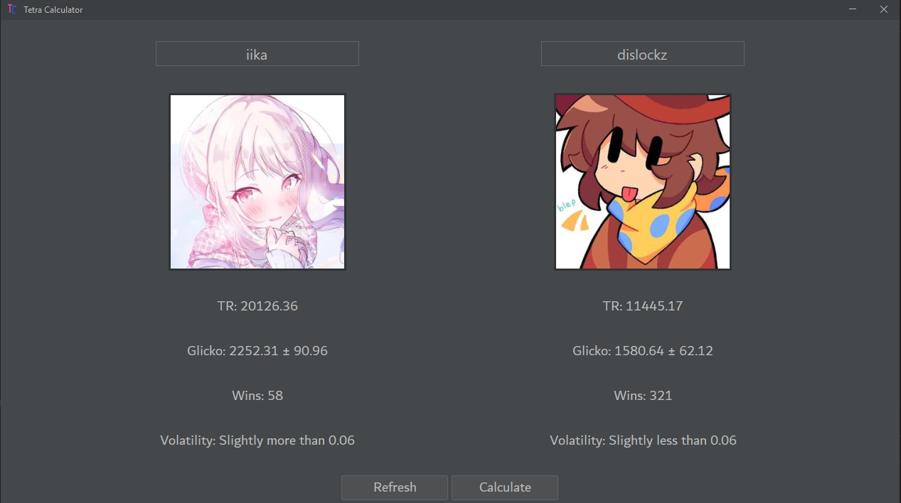
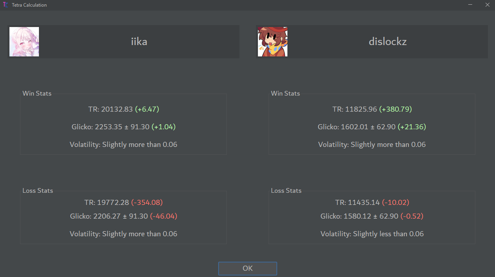

# Tetra Calculator 
A calculator that predicts what TR players will end up at after a match in [TETR.IO](https://tetr.io) Tetra League. (Accurate most of the time)

## How to Use (Requires [Java](https://adoptium.net/temurin/releases/?os=any&arch=any&version=21))
1. Run the `.jar` file
2. Enter 2 names in the text boxes on top
3. Click "Calculate"
4. Results will appear in a new window

---

